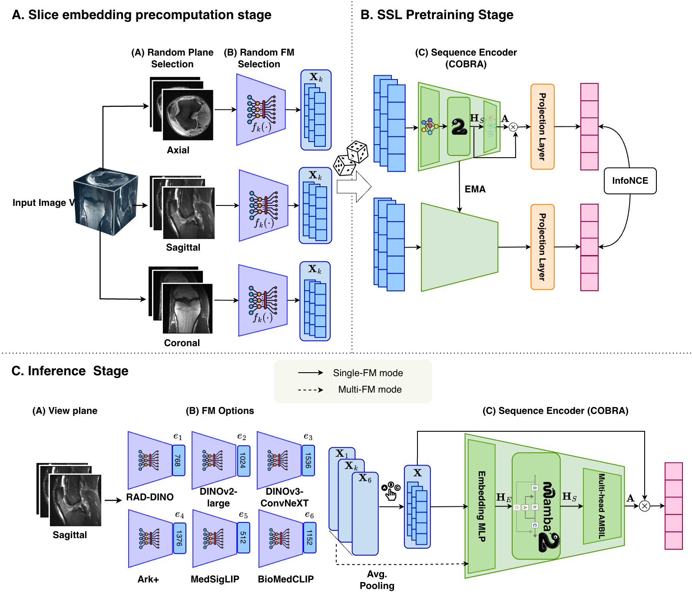
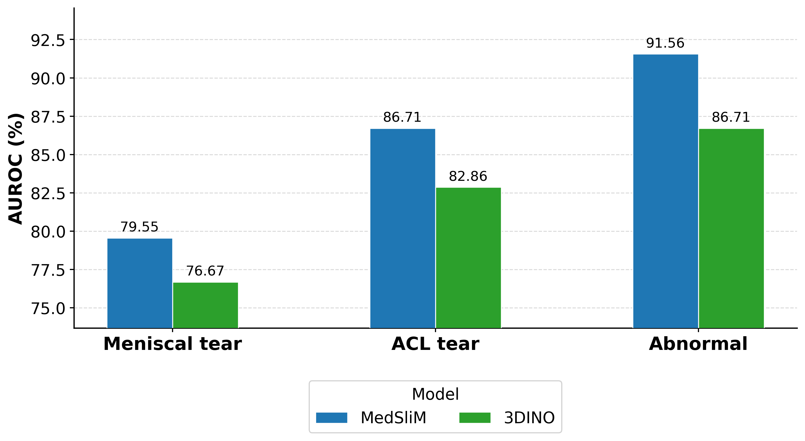
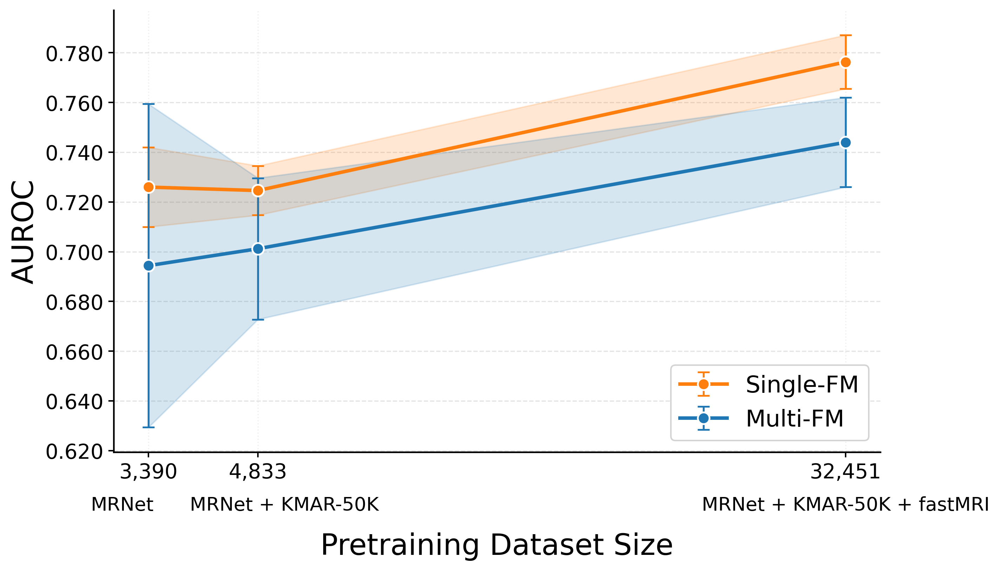
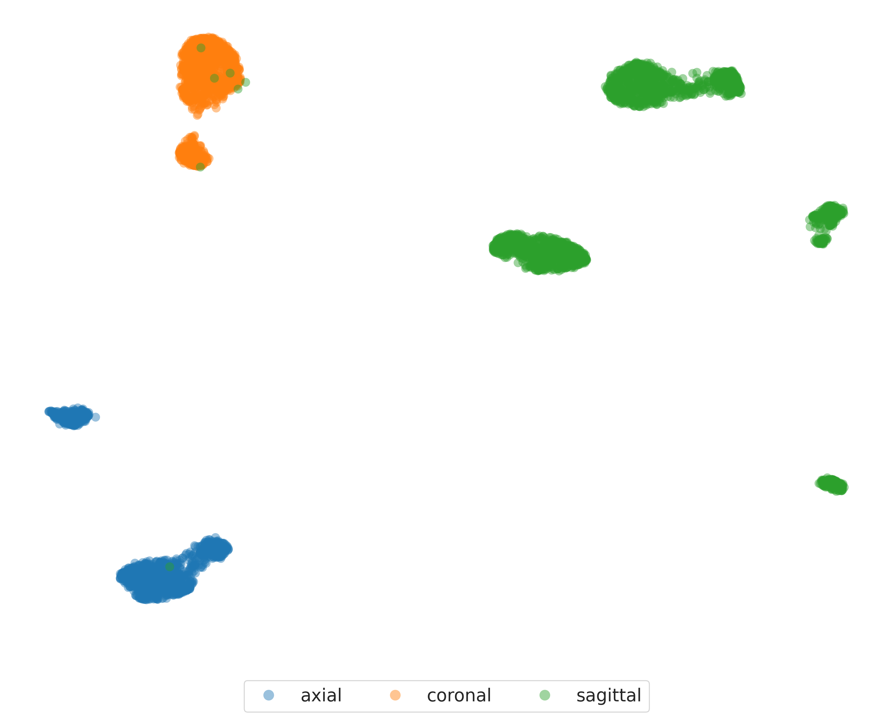
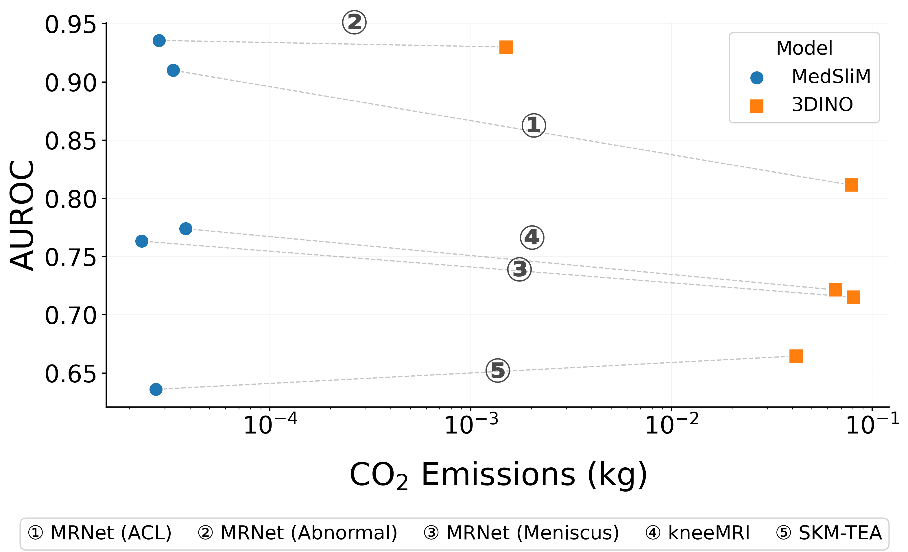

# MedSliM

**Med**ical **Sli**ce-wise **M**amba — Self-supervised pretraining for volumetric medical images from 2D foundation model features.

MedSliM extracts per-slice features from frozen 2D foundation models, then pretrains a [COBRA](#references) encoder (Mamba2 sequence encoder + ABMIL pooling) via cross-foundation-model contrastive learning (MoCo). The resulting volume-level representations transfer to downstream classification via linear probing or k-NN evaluation.

## Table of Contents

- [Installation](#installation)
- [Architecture](#architecture)
- [Usage](#usage)
  - [Data Preparation](#data-preparation)
  - [Pretraining](#pretraining)
  - [Evaluation](#evaluation)
  - [Visualization](#visualization)
- [Results](#results)
- [Configuration](#configuration)
- [Project Structure](#project-structure)
- [References](#references)

## Installation

### Prerequisites

- Python 3.12+
- CUDA 12.x with `nvcc`
- [uv](https://docs.astral.sh/uv/) (fast Python package manager)

```bash
curl -LsSf https://astral.sh/uv/install.sh | sh
```

Optionally, install [mise](https://mise.jdx.dev/) for automatic environment activation:

```bash
curl https://mise.run | sh
```

### Setup

```bash
git clone https://github.com/gary8564/MedSliM.git && cd MedSliM
uv venv --python=3.12
source .venv/bin/activate

# Install PyTorch and build dependencies first
uv pip install torch==2.6.0 setuptools packaging wheel numpy==2.2.5 hatchling editables

# Install the package
uv sync --no-build-isolation
uv pip install -e .
```

If using mise:

```bash
mise trust   # auto-activates .venv and loads .env
```

>[!NOTE]
>Troubleshooting
>**`causal-conv1d` / `mamba-ssm` / `flash-attn` build failures:** These packages compile CUDA kernels and require `nvcc`. Ensure CUDA is available and find the matching wheel for your setup at [mamba-ssm releases](https://github.com/state-spaces/mamba/releases) and [flash-attention releases](https://github.com/Dao-AILab/flash-attention/releases/tag/v2.7.4.post1).

## Architecture

MedSliM decomposes each 3D volume into axial, sagittal, and coronal slices, encodes them with different frozen 2D foundation models, and aggregates slice features with a Mamba2 sequence encoder and multi-head ABMIL pooling. Pretraining uses MoCo with cross-FM contrastive pairs; inference supports single-FM or multi-FM modes.

<p align="center">
  
</p>

## Usage

### Data Preparation

#### 1. Preprocess Datasets

See [docs/data.md](docs/data.md) for dataset descriptions, download sources, and preprocessing details.

#### 2. Precompute Slice Features

Run frozen 2D foundation models on every slice. This only needs to run once per (dataset, model, plane) combination. Features are saved as `.safetensors` files:

```
/path/to/feat_caches/<DatasetName>/slices_raw/<spatial-mode>/<model>/<split>/<plane>/<uid>.safetensors
```

See [docs/pretrained_models.md](docs/pretrained_models.md) for supported models and extraction commands.

### Pretraining

Train COBRA via MoCo cross-foundation-model contrastive learning. Requires precomputed features from **at least 2** foundation models.

Update feature cache paths in `med_slim/configs/pretrain.yml`, then run:

```bash
# Single GPU
accelerate launch --num_processes=1 --mixed_precision=bf16 \
    med_slim/train/train.py \
    --sequence-encoder mamba2 --pooling abmil --use-packed \
    --model-names dinov2 dinov3 rad-dino medsiglip biomedclip ark

# Multi-GPU (DDP)
accelerate launch --num_processes=4 --mixed_precision=bf16 \
    med_slim/train/train.py \
    --sequence-encoder mamba2 --pooling abmil --use-packed \
    --model-names dinov2 dinov3 rad-dino medsiglip biomedclip ark

# Resume from checkpoint
accelerate launch --num_processes=1 --mixed_precision=bf16 \
    med_slim/train/train.py \
    --sequence-encoder mamba2 --pooling abmil --use-packed \
    --resume /path/to/checkpoints/medslim-epoch2000.pth.tar

# Curriculum learning (load weights, reset optimizer/epoch for new datasets)
accelerate launch --num_processes=1 --mixed_precision=bf16 \
    med_slim/train/train.py \
    --sequence-encoder mamba2 --pooling abmil --use-packed \
    --resume /path/to/checkpoints/medslim-epoch2000.pth.tar --curriculum
```

**Available arguments:**

| Argument             | Description                                            |
| -------------------- | ------------------------------------------------------ |
| `--sequence-encoder` | `mamba2` or `transformer`                              |
| `--pooling`          | `abmil` or `cls` (`cls` requires `transformer`)        |
| `--use-packed`       | Packed variable-length sequences (no padding waste)    |
| `--model-names`      | Override FM models from config (space-separated)       |
| `--planes`           | Override planes from config (space-separated)          |
| `--resume`           | Path to checkpoint to resume training                  |
| `--curriculum`       | Load weights from `--resume` but reset optimizer/epoch |
| `-c` / `--config`    | Config file path                                       |

> [!NOTE]
> Staging features to local SSD (recommended on HPC clusters):
> Precomputed `.safetensors` feature files are read repeatedly across epochs. On HPC clusters where the parallel filesystem has high latency under concurrent load, staging these files to a local NVMe SSD before training significantly reduces I/O wait and compute waste.

> [!NOTE]
> Checkpoints are saved every 50 epochs to the path in `pretrain.yml`. Training is logged to [Weights & Biases](https://wandb.ai/).

### Evaluation

#### Linear Probing

Train a linear classifier on frozen COBRA embeddings with k-fold cross-validation.

Update `med_slim/configs/linear_classifier.yml` with your paths, then run:

```bash
python med_slim/eval/linear_classifier.py \
    --linear-classifier-config med_slim/configs/linear_classifier.yml \
    --checkpoint-path /path/to/checkpoints/medslim-epoch2000.pth.tar \
    --fm-model-names "mri-core medimageinsight ark dinov2 dinov3 rad-dino biomedclip medsiglip" \
    --sequence-encoder mamba2 \
    --fm-pooling avg_pool \
    --pooling-target raw \
    --weighted-loss \
    --n-folds 3
```

**Available arguments:**

| Argument                     | Description                                               |
| ---------------------------- | --------------------------------------------------------- |
| `--linear-classifier-config` | Config file path (required)                               |
| `--checkpoint-path`          | COBRA checkpoint (overrides config)                       |
| `--fm-model-names`           | FM models to use (space-separated string)                 |
| `--sequence-encoder`         | `mamba2` or `transformer`                                 |
| `--fm-pooling`               | `avg_pool` or `attention`                                 |
| `--pooling-target`           | Representation level: `raw`, `post_embed`, `post_encoder` |
| `--slice-pooling`            | `abmil` (for mamba2) or `cls` (for transformer)           |
| `--weighted-loss`            | Use class-weighted loss for imbalanced datasets           |
| `--fine-tune`                | Fine-tune COBRA backbone (not just linear head)           |
| `--n-folds`                  | Number of cross-validation folds                          |

#### k-NN Classification

```bash
python med_slim/eval/knn_classifier.py \
    --config med_slim/configs/linear_classifier.yml \
    --checkpoint-path /path/to/checkpoints/medslim-epoch2000.pth.tar \
    --fm-model-names "mri-core medimageinsight ark" \
    --sequence-encoder mamba2 \
    --pooling-target raw \
    --nb-knn 10 20 50 100 200 \
    --temperature 0.07
```

### Visualization

#### Slice Attention

Visualize per-slice ABMIL attention weights:

```bash
# From a fine-tuned experiment directory
python -m med_slim.eval.slice_attention \
    --experiment-dir /path/to/experiments/<experiment_folder> \
    --fold 3 --dataset-name SKM-TEA --split test --batch-size 8

# From a pretrained checkpoint (no fine-tuning)
python -m med_slim.eval.slice_attention \
    --checkpoint-path /path/to/checkpoints/medslim-epoch2000.pth.tar \
    --feat-dir /path/to/feat_caches/MRNet/slices_raw/crop \
    --annotations-path /path/to/datasets/preprocessed/MRNet/test.csv \
    --output-dir /path/to/experiments/slice_attention_MRNet \
    --dataset-name MRNet --plane sagittal --fm-model-names "mri-core" --split test
```

#### Embedding Clustering

Visualize COBRA embeddings with UMAP/t-SNE:

```bash
# Cross-dataset (color by plane)
python -m med_slim.eval.embed_cluster \
    --multi-dataset \
    --checkpoint-path /path/to/checkpoints/medslim-epoch2000.pth.tar \
    --fm-model-names "mri-core medimageinsight ark" \
    --output-dir /path/to/experiments/embed_cluster \
    --method umap --pooling-target post_embed --save-embeddings

# Single dataset (color by pathology)
python -m med_slim.eval.embed_cluster \
    --checkpoint-path /path/to/checkpoints/medslim-epoch2000.pth.tar \
    --feat-dir /path/to/feat_caches/MRNet/slices_raw/crop \
    --annotations-dir /path/to/datasets/preprocessed/MRNet \
    --output-dir /path/to/experiments/embed_cluster \
    --dataset-name MRNet --plane sagittal \
    --fm-model-names "mri-core medimageinsight ark" \
    --target-labels abnormal --task binary \
    --method umap --pooling-target raw --save-embeddings
```

## Results

All downstream metrics use frozen COBRA embeddings evaluated with 5-fold cross-validation. AUROC is reported as mean ± standard deviation. **Bold** indicates the best result per column; <u>underline</u> indicates second best. † denotes multi-FM inference with MRI-CORE as the pooling target.

### Downstream Classification

#### MRNet (binary classification)

| Model    | Meniscus Tear        | ACL Tear             | Abnormal              |
| -------- | -------------------- | -------------------- | --------------------- |
| MRNet    | <u>0.764 ± 0.023</u> | **0.943 ± 0.017**    | 0.755 ± 0.031         |
| MST      | **0.833 ± 0.033**    | <u>0.921 ± 0.025</u> | 0.880 ± 0.012         |
| 3DINO    | 0.726 ± 0.027        | 0.849 ± 0.033        | 0.922 ± 0.019         |
| MedSliM  | <u>0.764 ± 0.001</u> | 0.9165 ± 0.006       | **0.936 ± 0.002**     |
| MedSliM† | 0.755 ± 0.007        | 0.911 ± 0.009        | <u>0.9284 ± 0.003</u> |

#### kneeMRI (multi-class ACL injury severity)

Per-class and macro-averaged AUROC for Normal, Partial Tear, and Complete Rupture.

| Model    | Normal               | Partial Tear         | Complete Rupture     | Macro AUC            |
| -------- | -------------------- | -------------------- | -------------------- | -------------------- |
| MRNet    | **0.900 ± 0.033**    | **0.767 ± 0.015**    | <u>0.875 ± 0.021</u> | **0.843 ± 0.014**    |
| MST      | 0.699 ± 0.043        | 0.570 ± 0.054        | **0.882 ± 0.048**    | 0.717 ± 0.055        |
| 3DINO    | 0.720 ± 0.034        | 0.670 ± 0.028        | 0.771 ± 0.013        | 0.717 ± 0.012        |
| MedSliM  | 0.789 ± 0.050        | <u>0.689 ± 0.060</u> | 0.846 ± 0.025        | <u>0.777 ± 0.034</u> |
| MedSliM† | <u>0.791 ± 0.013</u> | 0.677 ± 0.017        | 0.861 ± 0.035        | 0.776 ± 0.012        |

#### SKM-TEA (multi-label classification)

Multi-label classification on DESS echo 1 (PD-weighted) and echo 2 (T2-weighted). Bold and underline indicate best and second best within each sequence.

**DESS E1**

| Model    | Meniscus            | Ligament            | Cartilage           | Effusion          | Macro AUC            |
| -------- | ------------------- | ------------------- | ------------------- | ----------------- | -------------------- |
| MRNet    | 0.561 ± 0.10        | <u>0.611 ± 0.10</u> | 0.553 ± 0.11        | 0.670 ± 0.13      | 0.600 ± 0.060        |
| MST      | 0.298 ± 0.30        | 0.489 ± 0.21        | <u>0.520 ± 0.19</u> | 0.602 ± 0.23      | 0.488 ± 0.065        |
| 3DINO    | <u>0.685 ± 0.08</u> | 0.552 ± 0.09        | 0.533 ± 0.10        | 0.656 ± 0.12      | **0.658 ± 0.013**    |
| MedSliM  | **0.699 ± 0.044**   | 0.508 ± 0.087       | **0.585 ± 0.111**   | 0.677 ± 0.110     | 0.617 ± 0.060        |
| MedSliM† | 0.624 ± 0.085       | **0.633 ± 0.108**   | 0.470 ± 0.143       | **0.878 ± 0.036** | <u>0.652 ± 0.014</u> |

**DESS E2**

| Model    | Meniscus             | Ligament             | Cartilage            | Effusion             | Macro AUC            |
| -------- | -------------------- | -------------------- | -------------------- | -------------------- | -------------------- |
| MRNet    | 0.615 ± 0.045        | **0.632 ± 0.034**    | <u>0.609 ± 0.023</u> | **0.935 ± 0.014**    | **0.710 ± 0.053**    |
| MST      | 0.410 ± 0.041        | 0.237 ± 0.036        | 0.493 ± 0.041        | 0.667 ± 0.021        | 0.461 ± 0.053        |
| 3DINO    | **0.687 ± 0.031**    | 0.569 ± 0.024        | **0.831 ± 0.009**    | 0.827 ± 0.010        | <u>0.697 ± 0.037</u> |
| MedSliM  | 0.612 ± 0.017        | <u>0.601 ± 0.025</u> | 0.403 ± 0.071        | 0.916 ± 0.016        | 0.632 ± 0.014        |
| MedSliM† | <u>0.623 ± 0.015</u> | 0.597 ± 0.024        | 0.424 ± 0.060        | <u>0.923 ± 0.016</u> | 0.643 ± 0.014        |

### k-NN vs. 3D Self-Supervised Learning

k-NN evaluation on MRNet test set. MedSliM consistently outperforms 3DINO across all three binary tasks without task-specific fine-tuning.

<p align="center">
  
</p>

### Pretraining Data Scaling

Macro-averaged AUROC on kneeMRI as pretraining data grows from MRNet alone to MRNet + KMAR-50K + fastMRI. Performance improves with scale; single-FM mode leads multi-FM at all dataset sizes.

<p align="center">
  
</p>

### Cross-Dataset Embedding Structure

UMAP of COBRA embeddings pooled across MRNet, kneeMRI, and SKM-TEA, colored by acquisition plane. Representations cluster by plane rather than by dataset, indicating shared anatomical structure across sources.

<p align="center">
  
</p>

### Efficiency vs. Performance

CO₂ emissions ([CodeCarbon](#references)) vs. AUROC across five downstream tasks. MedSliM achieves comparable or better AUROC than 3DINO at roughly three orders of magnitude lower inference emissions.

<p align="center">
  
</p>

## Configuration

YAML configuration files live in `med_slim/configs/`. Update placeholders (`/path/to/...`) before running.

| File                    | Purpose                                                                                    |
| ----------------------- | ------------------------------------------------------------------------------------------ |
| `pretrain.yml`          | SSL pretraining: datasets, foundation models, COBRA architecture, training hyperparameters |
| `linear_classifier.yml` | Linear probing / fine-tuning: checkpoint, dataset, training setup                          |
| `eval_datasets.yaml`    | Downstream dataset metadata: task types, label columns, display names                      |

CLI arguments override config values when both are provided.

## Project Structure

```
MedSliM/
├── med_slim/
│   ├── configs/                        # YAML configuration files
│   ├── data/                           # Dataset and dataloader classes
│   │   ├── slice_dataset.py            # NIfTI volume loading
│   │   └── feat_dataset.py             # Precomputed feature loading
│   ├── eval/                           # Evaluation scripts
│   │   ├── linear_classifier.py        # Linear probing with k-fold CV
│   │   ├── knn_classifier.py           # k-NN classification
│   │   ├── slice_attention.py          # Attention visualization
│   │   ├── embed_cluster.py            # UMAP/t-SNE embedding visualization
│   │   └── load_cobra.py               # Checkpoint loading utility
│   ├── model/
│   │   ├── sequence_encoder/cobra.py   # COBRA: Mamba2/Transformer + ABMIL
│   │   ├── ssl/moco.py                 # MoCo v3 self-supervised wrapper
│   │   └── slice_encoder/              # 2D foundation model wrappers
│   ├── train/train.py                  # Pretraining entry point
│   └── utils/
│       └── preprocessing/              # Transforms, augmentation
├── scripts/
│   ├── precompute_slice_feature.py     # Feature extraction CLI
│   └── preprocess_dataset/             # Dataset-specific NIfTI conversion
├── tests/                              # Unit and integration tests
├── docs/data.md                        # Dataset documentation
└── pyproject.toml
```

## References

1. Lenz, T., Neidlinger, P., Ligero, M., Wolflein, G., van Treeck, M., & Kather, J. N. (2025). _Unsupervised Foundation Model-Agnostic Slide-Level Representation Learning._ Proceedings of the IEEE/CVF Conference on Computer Vision and Pattern Recognition (CVPR). [Paper](https://openaccess.thecvf.com/content/CVPR2025/papers/Lenz_Unsupervised_Foundation_Model-Agnostic_Slide-Level_Representation_Learning_CVPR_2025_paper.pdf)

2. Courty, B., Schmidt, V., et al. (2024). _CodeCarbon: v2.4.1._ Zenodo. [https://doi.org/10.5281/zenodo.11171501](https://doi.org/10.5281/zenodo.11171501)
